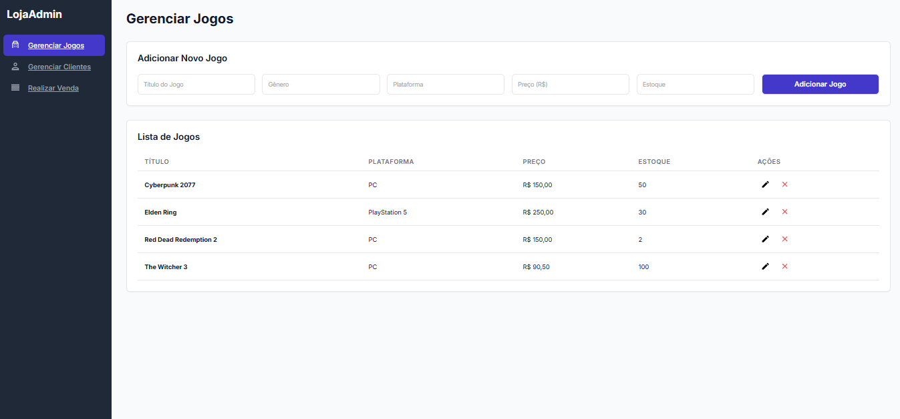
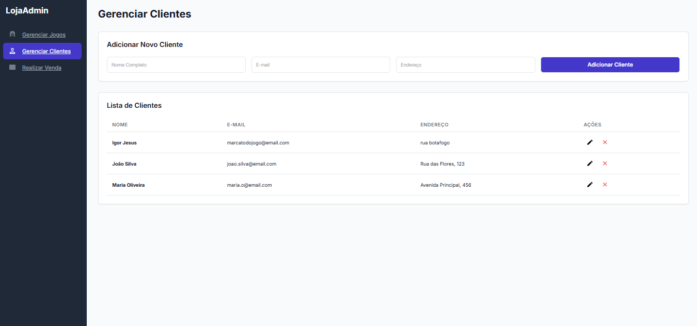
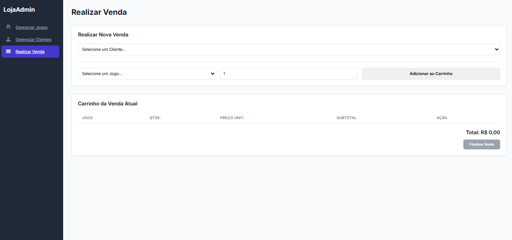

# # Painel Administrativo para Loja de Jogos (Full-Stack)

<div align="center">
  
  
  
  
  
  
</div>

## 📖 Visão Geral

Este é um projeto full-stack que simula um painel administrativo para uma loja de jogos. A aplicação permite o gerenciamento completo de jogos e clientes, e a simulação de vendas, seguindo o padrão CRUD (Create, Read, Update, Delete).

Este projeto foi construído como parte de um processo de aprendizado e desenvolvimento, demonstrando habilidades em todo o ecossistema de desenvolvimento web, desde a modelagem do banco de dados até a criação de uma interface de usuário funcional e moderna.

## 📸 Preview da Aplicação

<p align="center">
  <a href="screenshots/print_jogos.png" target="_blank">
    
  </a>
</p>

<p align="center">
  <a href="screenshots/print_clientes.png" target="_blank">
    
  </a>
  <a href="screenshots/print_vendas.png" target="_blank">
    
  </a>
</p>

## ✨ Features

- **Gerenciamento de Jogos:** Adicionar e remover jogos do catálogo.
- **Gerenciamento de Clientes:** Adicionar e remover clientes da base de dados.
- **Simulação de Vendas:** Selecionar um cliente e adicionar múltiplos jogos a um "carrinho" para simular uma transação.
- **Interface Reativa:** A interface é atualizada em tempo real sem a necessidade de recarregar a página.
- **Segurança:** As credenciais do banco de dados são gerenciadas de forma segura através de variáveis de ambiente.

## 🛠️ Tecnologias Utilizadas

- **Front-end:** HTML5, CSS3, JavaScript (ES6+)
- **Back-end:** Node.js, Express.js, CORS, Dotenv
- **Banco de Dados:** MySQL
- **Ferramentas:** `npm`, Git, VS Code

## 📂 Estrutura do Projeto

O projeto está organizado em uma estrutura de monorepo, contendo três pastas principais:

```
/
|-- /database/          (Contém os scripts para criação e população do BD)
|-- /loja-jogos-frontend/ (Contém a interface do usuário)
|-- /loja-jogos-backend/  (Contém a API e a lógica de negócio)
|-- /screenshots/  (Contém os prints da API)
```

## 🚀 Como Rodar o Projeto Localmente

### Pré-requisitos

- [Node.js](https://nodejs.org/en/) (que já inclui o npm)
- Um servidor MySQL rodando localmente.

### 1. Configurar o Banco de Dados

1. Use um cliente MySQL (como o MySQL Workbench) para se conectar ao seu servidor.
2. Execute o script do arquivo `database/1_schema.sql` para criar a estrutura das tabelas.
3. Execute o script do arquivo `database/2_dados_iniciais.sql` para popular o banco com dados de exemplo.

### 2. Configurar e Rodar o Back-end

1. Navegue até a pasta `loja-jogos-backend` pelo seu terminal.
2. **Importante:** Crie um arquivo `.env` nesta pasta e adicione sua senha do MySQL: `DB_PASSWORD=sua_senha_aqui`.
3. Instale as dependências com o comando: `npm install`
4. Inicie o servidor com o comando: `node server.js`
5. O servidor estará rodando em `http://localhost:3001`.

### 3. Rodar o Front-end

1. Navegue até a pasta `loja-jogos-frontend`.
2. Abra o arquivo `index.html` em seu navegador, preferencialmente usando uma extensão como o "Live Server" do VS Code.

A aplicação estará totalmente funcional!
